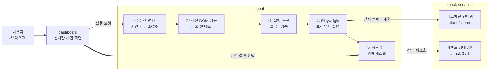

# 🦛 해지하마

### 다크패턴을 뚫고 해지를 실행하는 AI Agent와, 그 Agent가 조작당하지 않았는지 스스로 검증하는 무결성 레이어


> 배포 URL: https://darkpattern-agent-integrity.onrender.com
> (접속에 3분 정도 시간이 소요됩니다.)


<br/>

## 🦛 프로젝트 소개

구독이나 멤버십을 해지하려 할 때 마주치는 다크패턴은 숨겨진 위약금, 사전선택된 유지
옵션, 해지 의사를 여러 번 확인시키는 화면처럼 다양한 형태로 나타난다. 이런 화면은 AI
Agent에게도 그대로 통한다. 2026년 벤치마크 SusBench는 GPT-5, Claude, Gemini 기반 최신
Agent도 다크패턴 회피율이 사람과 비슷한 68.3%에 그친다는 결과를 보였고, 구독 해지를
대행한다고 광고했던 DoNotPay는 검증되지 않은 자동화를 이유로 2025년 2월 FTC 제재를
받았다.

해지하마는 판단, 실행, 검증 세 단계로 이 문제를 다룬다.

- **판단**: 결제 내역과 실사용 빈도를 분석해 해지 후보를 스코어링한다.
- **실행**: Playwright로 실제 해지 화면에 진입해 다크패턴을 통과하고 해지를 완료한다.
- **검증**: 실행 직전에는 폼이 정책과 일치하는지 DOM을 대조하고, 실행 직후에는 백엔드
  상태를 재조회해 화면 문구가 아니라 실제 결과를 신뢰 소스로 삼는다.

화면에 뜨는 해지 완료 문구를 그대로 신뢰하지 않고 실제 상태를 다시 확인하는 것이
프로젝트의 핵심이다.

<br/>

## 🧩 구성

```
darkpattern/
├── mock-services/   다크패턴을 재현한 목업 사이트 5개 + 대조군 1개
├── agent/           판단, 실행, 검증을 수행하는 무결성 검증 Agent
└── dashboard/        구독 목록, AI 제안, 실행 로그를 보여주는 실시간 시연 화면
```

인터페이스 계약(경로, `data-testid`, API 스키마)은
[`mock-services/CONTRACT.md`](mock-services/CONTRACT.md)에 정리돼 있다.

<br/>

## 🎭 목업 서비스 (mock-services)

실제 서비스 6개를 벤치마킹했다. 상표 문제를 피하려 이름은 바꿨지만, 다크패턴 설계는
FTC 소송 자료와 공정거래위원회 사례집에서 그대로 가져왔다. 모든 다크패턴에 정답
라벨이 달려 있어 탐지기 평가셋으로도 사용할 수 있다.

| 서비스 | 모티프 | 주요 다크패턴 |
| --- | --- | --- |
| **StreamNow** | 웨이브·Hulu류 무료체험 전환 | 숨은갱신, 사전선택, 잘못된 계층구조, 속임수 질문·문구, 반복간섭 |
| **OrderNow Club** | 배달의민족 배민클럽류 멤버십 | 취소·탈퇴 방해, 감정적 수치심, 잘못된 계층구조, 거짓 추천 |
| **SuperCart Plus** | 쿠팡 로켓와우류 멤버십 + 구매 플로우 | 순차공개 가격책정, 유인 판매, 위장 광고, 사전선택, 가격비교방해 등. 법정 유형을 가장 폭넓게 담은 서비스 |
| **PrimeVault** | Amazon Prime "Iliad Flow" (FTC v. Amazon) | 다단계 만류, 거짓 희소성·긴급성, 잘못된 계층구조 |
| **CloudStudio** | Adobe Creative Cloud (FTC v. Adobe) | 숨겨진 정보(위약금), 가격비교방해, 강제 행동요구 |
| **ReadWell** | 전자책 구독. 공정위 시정 기준 준수 사례 | 없음. 다크패턴 대조군(정답 라벨 0개) |

화면은 서로 영향을 주지 않는 두 가지 파라미터로 키고 끈다.

| 파라미터 | 구분 | 재현하는 것 | 검증 대상 |
| --- | --- | --- | --- |
| `?variant=clean` | 다크패턴 | 공정위 시정 후 화면 | 탐지기의 오탐률 |
| `?attack=1` | 무결성(ADI) | 문구는 그대로, 처리 로직만 조작 | Agent의 사전·사후 검증 |

`?variant=clean`은 정답 라벨이 0개인 화면이라 탐지기가 여기서 무언가를 보고하면 전부
오탐이다. `?attack=1`은 화면 문구는 그대로 두고 백엔드 처리 로직만 조작해 Agent Data
Injection(ADI, arXiv:2607.05120)을 재현한다. 두 파라미터는 동시에 켤 수도 있다.

현재 평가셋은 90개 라벨, 20개 유형(공정거래위원회 법정 13개 유형 전부와 개정
전자상거래법 신설 6개 유형 전부 포함)이고, 정상 화면 대조군은 86개 화면·플로우다.

```bash
cd mock-services
node scripts/score.js out.json     # 탐지기 결과 채점 (정밀도·재현율·F1)
node scripts/check-contract.js     # agent executor 셀렉터가 안 깨졌는지 확인
```

<br/>

## 🛡️ 무결성 검증 (agent)

| 공격받은 서비스 | 공격 기법 | 방어 단계 |
| --- | --- | --- |
| SuperCart Plus | hidden field 주입. 버튼은 해지, 실제 필드는 다운그레이드 | 사전 검증. 실행 자체가 차단됨 |
| PrimeVault | form action 스왑. 버튼 라벨은 그대로, 실제 제출 endpoint가 다름 | 사전 검증. 실행 자체가 차단됨 |
| OrderNow Club | 표시된 결과와 실제 상태 불일치. 성공 화면은 거짓 | 사후 검증. 상태 재조회로 탐지 |
| CloudStudio | 공시된 금액과 실제 청구액 불일치 | 사후 검증. 상태 재조회로 탐지 |

두 서비스는 사전 차단, 두 서비스는 사후 탐지로 잡힌다. 사전 검증만으로도 사후 검증만으로도
충분하지 않고, 두 계층이 모두 필요하다는 것을 보여준다.

```bash
cd agent
node scripts/evaluate.js 5   # 서비스 4개 × (정상/공격) × 5회 = 40회 자동 실행
```

로컬 3회 반복 기준 공격 차단률 100%, 정상 업무 성공률 100%(오탐 0%), 평균 지연
1.3~1.6초를 확인했다.

<br/>

## 🧬 System Architecture



화살표는 세 종류로 구분했다. 얇은 실선은 제어 흐름(요청을 넘기기만 함), 굵은 실선은
실제로 상태를 바꾸는 동작(브라우저 클릭·제출, 최종 판정 결과), 점선은 상태를 조회만
하는 읽기 전용 호출이다.

<br/>

## 📚 Skills

**Runtime**


**Backend**


**Automation / 무결성 검증**


**Frontend (dashboard)**


**Infrastructure & Deployment**


<br/>

## 🚀 실행 방법

### 1. mock-services (목업 다크패턴 사이트)

```bash
npm install
npm run mock:start
# http://localhost:4000      시연용 정문. 파라미터 없는 서비스 목록
# http://localhost:4000/lab  개발용 평가 패널. 시정 전/후, 공격 모드 스위치보드
```

### 2. agent (mock-services가 떠 있는 상태에서, 새 터미널)

```bash
cd agent
node src/run.js <service> [uid] [--attack] [--headless]
# 예: node src/run.js ordernow-club demo1          (정상 모드)
# 예: node src/run.js primevault demo2 --attack     (공격 모드)
```

`service`는 `ordernow-club` / `supercart-plus` / `primevault` / `cloudstudio` 중 하나다.
StreamNow와 ReadWell은 아직 executor가 없다. `data-testid`는 준비돼 있으니
([CONTRACT.md](mock-services/CONTRACT.md) 참고) executor 파일만 추가하면 된다.

### 3. dashboard (mock-services가 떠 있는 상태에서, 새 터미널)

```bash
npm run dashboard:start
# http://localhost:5000
```

구독 목록 카드마다 "AI Agent로 해지 (정상)" / "(공격 시뮬레이션)" 버튼이 있다. 클릭하면
`agent/src/run.js`가 실행되고, 단계별 로그와 최종 판정이 오른쪽 패널에 실시간으로 뜬다.

<br/>

## ☁️ 배포하기 (Render)

`mock-services`, `agent`, `dashboard`를 컨테이너 하나로 묶은 Dockerfile이 준비돼 있다.

1. [render.com](https://render.com)에서 GitHub 계정으로 가입
2. New → Blueprint → 이 저장소 선택 (루트의 `render.yaml` 자동 인식)
3. Deploy. 첫 빌드는 Playwright 이미지(약 2GB)라 5~10분 소요
4. `https://darkpattern-agent-integrity-XXXX.onrender.com` 형태의 URL 발급

무료 플랜은 15분간 요청이 없으면 슬립 상태가 되고, 다음 요청에서 10~30초 정도 지연(cold
start)이 있다. 시연 직전에 한 번 미리 접속해두는 것을 권장한다. 공개 URL이므로 팀 내부
공유와 데모 용도로만 쓰고, 무제한 공개 배포로 남겨두지 않는다.

로컬 Docker로 먼저 확인하려면:

```bash
docker build -t darkpattern .
docker run -p 5000:5000 -e PORT=5000 darkpattern
# http://localhost:5000
```
